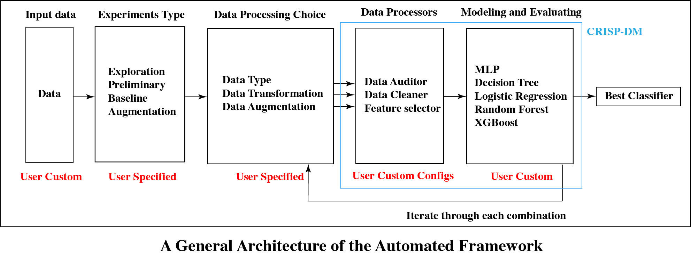

# Mitigating Batch Effects and Enhancing Cooperativeness Classification in Human Survey Data



## Data Installation
To download the data, go to this [website](https://www.icpsr.umich.edu/web/ICPSR/studies/36371/publications), click on **Download**, and select **Delimited**. The website requries the user to create an account to be able to download the data. A ICPSR_36371-V1.zip file will be installed, unzip it, and put the unzipped ICPSR_36371-V1 folder under the data directory.

## Environment
To run the scripts, please set up the environment as follow:
```
conda create -n dataMine python=3.8  
conda activate dataMine
pip3 install -r requirements.txt
```

## Experiments
To execute the script, please run the command `python3 experiment` with the following choice of arguments:

```
-t: ["oneW"]
-d: ["raw", "pca", "umap", "pca_umap"]
-a: ["smote", "editNN", "tomkLink", "smoteNN", "smoteTomek"]
-e: ["explore", "preliminary", "baseline", "augmentation"]
-gan: -gan or nothing
```

The script is highly-module based, by specifying -e, user can choose the experiment to run.

### Exploration
For exploration experiment, user can specify whatever combination of arguments to use, for example:
```
python3 experiment.py -e explore -t oneW -d pca_umap -a smote -gan
```
This command executes experiment using transformed data with pca_umap data type augmented by SMOTE and GAN.


```
python3 experiment.py -e explore -d raw
```
This command executes experiment using untransformed data with raw data type without any data augmentation methods.

```
python3 experiment.py -e explore -d raw -smoteTomek
```
This command executes experiment using untransformed data with raw data type with smoteTomek augmentation.

### Preliminary Experiment to explore batch effect
User could use the follow command to execute experiment for exploring batch effects:
```
python3 experiment.py -preliminary
```
This module iterates through all data types (-d).

### Baseline Experiment to Benchmark Baseline Performance
User could use the follow command to execute experiment for creating benchmark performance of given classifiers:
```
python3 experiment.py -baseline
```
This module iterates through all data types and transformation (-d, -t).

### Benchmark Data Augmentation Methods
User could use the follow command to execute experiment for benchmarking data augmentation methods:
```
python3 experiment.py -augmentation
```
This module iterates through all data types, transformation, data augmentation methods, and whether to use GAN (-d, -t, -a, -gan).

## Results
After executing the experiments, we also provide a script for user to clean up the results and create figure. 
The command is 
```
python3 plot.py
``` 
with argument -e (result1, result2, result2) correpsonding to which experimental results to analysis. Result1 refers to the preliminary experiment, result2 refers to the baseline experiment, result3 refers to the augmentation experiment.